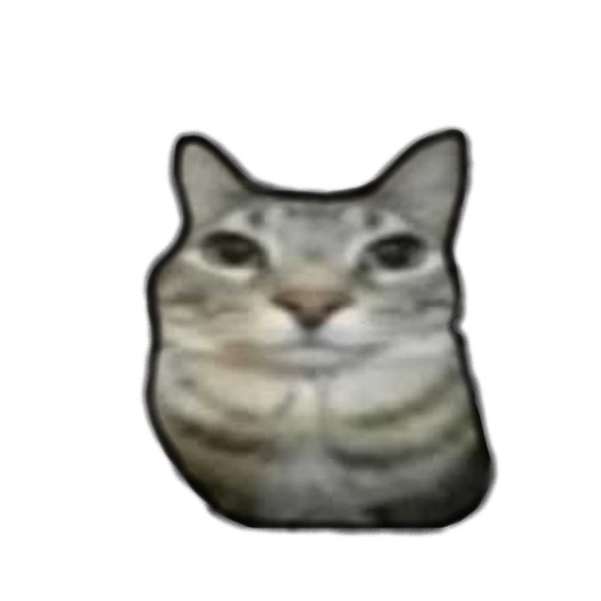

# PurrBeat
**PurrBeat** — это ритмичная музыкальная игра в жанре non-stop, разработанная на базе PyGame. Игроки смогут выбирать из списка уровней, каждая из которых представляет собой уникальную песню. В игре будет список лидеров по количеству очков. Сами уровни генерируются на основе рандома, может повезти с прохождением, а может и нет. В игре присутствуют 5 уровней.

# Игровые режимы
В PurrBeat представлены три основных режима игры, которые переключаются в зависимости от текущего момента песни:
- Osu режим: В этом режиме на экране появляются кружочки, которые необходимо вовремя нажать, чтобы набрать очки. Сама механика взята из игры Osu;

    
    
    
    
    

- Волна режим: Игроки превращаются в волну и должны избегать препятствий. Сама механика взята из игры Geometry Dash;

    
    
    
    
    

- Пианино режим: В этом режиме игроки используют 4 кнопки для игры на пианино, аналогично механике игры Friday Night Funkin’.
Эти режимы разнообразят игровой процесс, позволяя игрокам наслаждаться различными стилями взаимодействия с музыкой и ритмом.

    
    
    
    

# Файлы (скрипты, конфиг) используемые в игре
- classes.py - файл, где хранятся классы с которыми работают другие файлы (Buttons, VolumeSlider, TextBox, ResolutionManager, AnimatedSprite, LeaderBoard);
- game.py - файл, где создаются уровни, которые основаны на бит-дорожке (map.json) и самой музыке (music.mp3);
- generate_beat_for_song.py - файл, для создания бит-дорожки на основе музыки;
- main.py - файл, где находится меню игры, его нужно запускать первым;
- config.ini - файл, где хранится конфигурация программы, можно её изменить и увидеть желаемый результат.

# Используемые библиотеки в игре: 
- pygame - для создания самой же видеоигры;
- sqlite3 - для работы с таблицей лидеров в игре;
- librosa - для анализа звукового файла, чтобы сделать бит-дорожку для уровня;
- json - для создания файла бит-дорожки и дальнейшего его использования;
- random - для создания случайных препятствии, стрелок, кружков на разных позициях;
- configparser - для прочтения файла конфигурации;
- sys - для завершения работы игры;
- time - для создания загрузки, прогрузки текстур, уровня.

# Прочее
Используемые песни взяты из открытых источников, в частности с YouTube. Функции и классы, а также их назначение, изложены непосредственно в коде файла.
